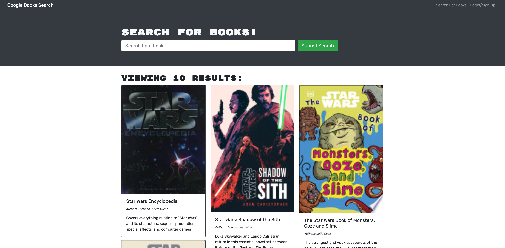

# Book-Engine-21

## Description

The Book search engine is an application is leveraging the entire MERN stack and with a React front end, MongoDB database, and Node.js/Express.js server and API. It's set up to allow users to save book searches to the back end. The application is built using Google Books API search engine build with GraphQL API and Apollo Server. 

This project was bootstrapped with [Create React App](https://github.com/facebook/create-react-app).

### Live Site
https://bookengine21.herokuapp.com//

### Preview 

### Tech used
HTML, CSS, JavaScript, Mongodb, GraphQL, Node, React

## Installation 

To install this project into your own, use `git clone <REPONAME>` in your command-line, then `npm init` to install the listed dependencies.

## Usage 

To use this repo, go to the cloned files, then type `npm run develop` in your command-line. Be sure you’re in the correct location in your command-line/terminal(ROOT!) first! Be sure you're also set up to run a react app!
preview

